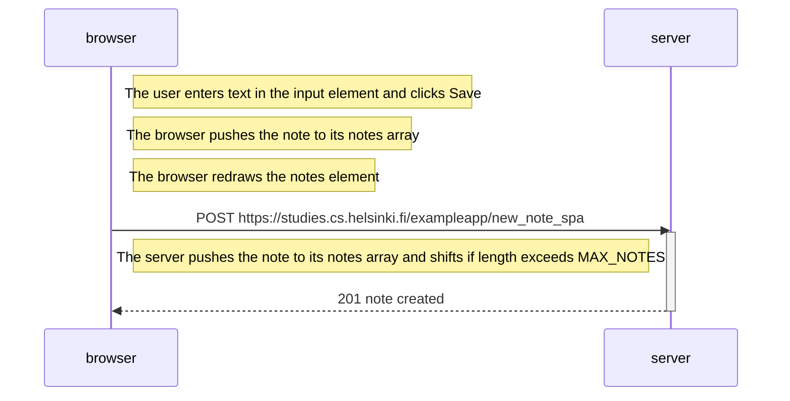

```mermaid
sequenceDiagram
    participant browser
    participant server

    Note right of browser: The user enters text in the input element and clicks Save
    Note right of browser: The browser pushes the note to its notes array
    Note right of browser: The browser redraws the notes element

    browser->>server: POST https://studies.cs.helsinki.fi/exampleapp/new_note_spa
    activate server
    Note left of server: The server pushes the note to its notes array and shifts if length exceeds MAX_NOTES
    server-->>browser: 201 note created
    deactivate server
```
